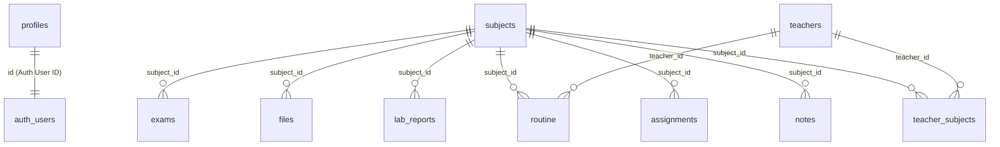

<p align="center">
  
</p>

<h1 align="center">Orios Class Portal V2</h1>

<p align="center">
  <strong>A premium, modern, mobile-first class companion application.</strong>
</p>

<p align="center">
  <em>Beautifully rebuilt from the ground up for speed, fluidity, and full database integration.</em>
</p>

<p align="center">
  
  
  
  
  
  
</p>

---

## 🌟 Introduction

**Orios Portal V2** is a fast, light, and modern class management app. Transitioned from a bloated Docusaurus site to a flat, mobile-first **Next.js 15 (App Router)** setup, it connects directly to a **Supabase (PostgreSQL)** backend and is optimized to run at the edge on **Cloudflare Workers / Pages**.

It features a "Quiet Premium" aesthetic — a dark-first, minimal UI built on a zinc palette with subtle indigo accents, smooth micro-animations, and full offline-ready structure.

---

## 🎯 Key Features

| | Feature | Description |
|---|---|---|
| 🗓️ | **Interactive Routine** | A clean, visual weekly routine grid displaying daily classes, rooms, and teachers. |
| ⏳ | **Live Countdowns** | Countdown timers tracking exams, assignment deadlines, and lab submissions. |
| 📝 | **Notes Registry** | Filter notes by subject, with links to PDFs, docs, slides, and websites. |
| 📋 | **Assignment Tracker** | Visual board tracking assignments with due dates and submission status (`pending` / `submitted`). |
| 🧪 | **Lab Reports** | Subject-wise lab report organization, tracking lab experiment numbers and statuses. |
| 📂 | **File Sharing** | A file vault hosting class syllabus, code packages, and exam papers. |
| 👨‍🏫 | **Teacher Directory** | Contacts, emails, initials, office locations, and office hours for faculty. |
| 🔍 | **Interactive Search** | Global command-palette search (`⌘K` or click) to filter notes, files, or deadlines instantly. |
| 🌗 | **Theme Toggle** | Native dark/light mode toggle that respects user preference and system defaults. |
| 🛡️ | **Admin Panel** | Secure portal to create, edit, or delete notes, schedules, files, and assignments. |

---

## ⚙️ Architecture & Tech Stack

- **Framework**: [Next.js 15 (App Router)](https://nextjs.org/) for optimized static generation, route handlers, and middleware.
- **Frontend**: [React 19](https://react.dev/) & [Tailwind CSS v4](https://tailwindcss.com/) for fluid, utility-driven responsive design.
- **Database**: [Supabase PostgreSQL](https://supabase.com/) for structured data storage with Row-Level Security (RLS).
- **Authentication**: Supabase Auth integrated with custom triggers to provision user roles.
- **Storage**: Supabase Storage Buckets to hold PDFs, ZIPs, images, and source code.
- **Deployment**: Deployed via `@opennextjs/cloudflare` to run at the edge on Cloudflare Pages.

---

## 📊 Database Schema

The database uses PostgreSQL relationships with cascade deleting. A custom trigger automatically registers a corresponding row in the `profiles` table when users sign up.



- **Row Level Security (RLS)** is enabled on all tables.
- Public read access is permitted for general users (`SELECT`).
- Write operations (`INSERT`, `UPDATE`, `DELETE`) are restricted to authenticated admin users verified by a custom Postgres helper function (`public.is_admin()`).

---

## 📁 Repository Structure

```text
Orios-V2/
├── app/                  # Next.js App Router routes & pages
│   ├── admin/            # Secure admin dashboard for database management
│   ├── assignments/      # Assignments tracking page
│   ├── files/            # Shared downloads vault
│   ├── lab-reports/      # Lab report tracker
│   ├── notes/            # Notes index
│   ├── schedule/         # Daily & weekly routine
│   ├── teachers/         # Faculty directory
│   ├── globals.css       # Tailwind directives & core design system tokens
│   └── page.js           # Portal Home (Deadlines, stats, today's schedule)
├── components/           # Reusable UI component library (AppShell, Card, Search)
├── lib/                  # Database connections, context & helper functions
│   ├── supabase/         # Supabase client instance & SSR configurations
│   ├── mock-data.js      # Mock datasets used during offline development
│   └── subjects.js       # Centralized subject registry & metadata
├── public/               # Static assets, logos, and mascot images
├── scripts/              # Migration, seeding, and database utilities
│   ├── migrate.mjs       # Seed script (inserts mock data into database)
│   └── clear-db.mjs      # Cleanup script (purges database data safely)
├── wrangler.jsonc        # Cloudflare pages deployment settings
├── open-next.config.ts   # OpenNext builder configuration
├── supabase_schema.sql   # Complete PostgreSQL Schema & seed file
└── README.md             # Developer documentation
```

---

## 🚀 Quick Start

### 1. Clone & Install
```bash
git clone https://github.com/tokitauhid/Orios-V2.git
cd Orios-V2
npm install
```

### 2. Configure Environment Variables
Copy `.env.example` to `.env.local`:
```bash
cp .env.example .env.local
```
Open `.env.local` and add your Supabase credentials:
```env
NEXT_PUBLIC_SUPABASE_URL=https://your-project-id.supabase.co
NEXT_PUBLIC_SUPABASE_ANON_KEY=your-public-anon-key
SUPABASE_SERVICE_ROLE_KEY=your-private-service-role-key-for-seeding
```

### 3. Initialize the Database
1. Go to your **Supabase Dashboard** -> **SQL Editor**.
2. Copy the contents of [`supabase_schema.sql`](file:///home/tokit/Projects/Orios-V2/supabase_schema.sql) and execute the query to set up tables, RLS policies, storage bucket configurations, and authentication triggers.

### 4. Database Commands
We provide pre-configured scripts in `package.json` to manage your data:

- **Seed Mock Data**: Populates your database with default subjects, teachers, notes, files, assignments, and routine slots.
  ```bash
  npm run db:seed
  ```

- **Clear Database**: Safely deletes all records from active tables (notes, files, schedule, etc.) and resets ID autoincrement sequences.
  > [!IMPORTANT]
  > This preserves user authentication records and roles in `profiles` to prevent locking you out of the admin panel.
  ```bash
  npm run db:clean
  ```

### 5. Run Locally
Start the local Next.js development server:
```bash
npm run dev
```
Open [http://localhost:3000](http://localhost:3000) to view the portal.

---

## ☁️ Deployment (Cloudflare)

This application is configured for deployment to **Cloudflare Pages** using `@opennextjs/cloudflare`.

### Build
Generate the production-ready OpenNext build:
```bash
npm run build
```

### Deploy
Deploy directly to your Cloudflare account:
```bash
npm run deploy
```

---

## 📄 License

This project is licensed under the [MIT License](LICENSE). Built with ♥ for section students.
